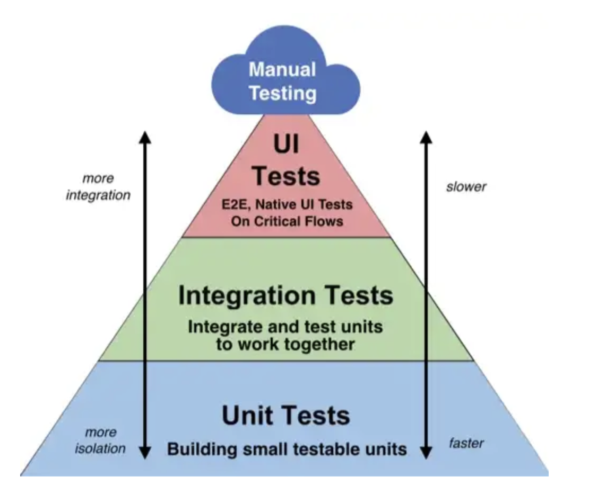

# Tests 

> Selon-vous, qu’est-ce un test ?

 - Un moyenne pour savoir si une fonctionalité fonction;

> À quoi servent les tests ?

- Teste differant methodes, fonction pour eviter tous les errors;

> Y a-t-il plusieurs types de tests ? Si oui, quelle est leur différence ?

- Test unitaire;       (test cote server)
- Test de performance; (light house);
- Test fonctionnel;    (tester un bloc d'une fonctionalite)
- Test end to end;     (test cote interface)

> Intuitivement, à quelles bonnes pratiques de conception de tests, vous pouvez penser ?

- Decouper son code;

## Vitest

Vitest est un framework de test d’unités JavaScript. Il a été créé pour compléter Vite, un outil pour aider à gérer et à construire des applications Web basées sur JavaScript.

run vitest  => npx vitest

it(description, testFunction): Функція it (або test, це синоніми) використовується для створення окремого тест-кейсу. Вона приймає два параметри:

description: Це описовий рядок, який пояснює, що тест робить. Цей рядок відображається під час виконання тестів і допомагає зрозуміти, що саме перевіряється в тесті.

testFunction: Це функція, яка містить логіку тесту. У цій функції ви визначаєте кроки тестування та викликаєте функцію expect для перевірки результату.

expect(value): Функція expect приймає значення, яке ви хочете перевірити, і повертає об'єкт "expectation". Цей об'єкт містить методи для визначення очікуваного результату. 

Найпоширеніші методи включають:

    - toBe(expected): Перевірка, чи значення рівне очікуваному значенню.

    - toEqual(expected): Перевірка на глибоку рівність об'єктів.

    - not.toBe(expected): Перевірка, що значення не рівне очікуваному значенню.

    - toThrow(expected): Перевірка, що функція генерує виключення, яке співпадає з     
      очікуваним.

## Coverage test

Un "coverage test" (ou "test de couverture" en français) est une technique utilisée dans le domaine du développement logiciel pour évaluer dans quelle mesure le code source d'un programme est testé par des tests automatisés. L'objectif principal de cette pratique est de mesurer la "couverture" des tests, c'est-à-dire combien de parties du code sont exécutées par les tests. Un code bien testé devrait idéalement avoir une couverture élevée, ce qui signifie que la plupart, voire la totalité, de ses lignes de code sont exécutées au moins une fois par les tests. Un code non testé ou insuffisamment testé aura une couverture faible, laissant des zones de code non vérifiées et potentiellement sujettes à des erreurs.

Il existe plusieurs types de couverture de test, notamment :

- La couverture de ligne : Elle mesure quelles lignes de code ont été exécutées par les tests.

- La couverture de branche : Elle mesure quelles branches de contrôle (par exemple, les conditions if/else) ont été testées.

- La couverture de décision : Elle est similaire à la couverture de branche, mais elle se concentre sur la prise de décision au niveau de chaque condition.

- La couverture de chemin : Elle vise à tester tous les chemins possibles à travers le code.

"Istanbul" est un outil de couverture de code largement utilisé dans l'écosystème JavaScript, principalement pour Node.js et les applications Web. Il peut être utilisé pour mesurer la couverture de code de vos tests JavaScript, qu'il s'agisse de tests unitaires, de tests d'intégration ou de tests fonctionnels. Istanbul prend en charge la couverture de ligne, la couverture de branche, la couverture de décision et la couverture de chemin.

Lorsque vous exécutez vos tests à l'aide d'Istanbul, il génère des rapports détaillés indiquant quelles parties de votre code ont été testées et quelles parties restent non testées. Cela vous aide à identifier les zones de votre code qui nécessitent une attention particulière en matière de tests.

Les outils d'analyse de la couverture, comme Istanbul, sont essentiels pour s'assurer que votre code est robuste et fiable, car ils vous aident à identifier les zones non testées qui pourraient potentiellement provoquer des erreurs ou des bogues. Cela vous permet d'améliorer la qualité de votre code et d'augmenter la confiance dans sa stabilité.

## Automatisation des tests 

https://doka.guide/tools/github-actions/